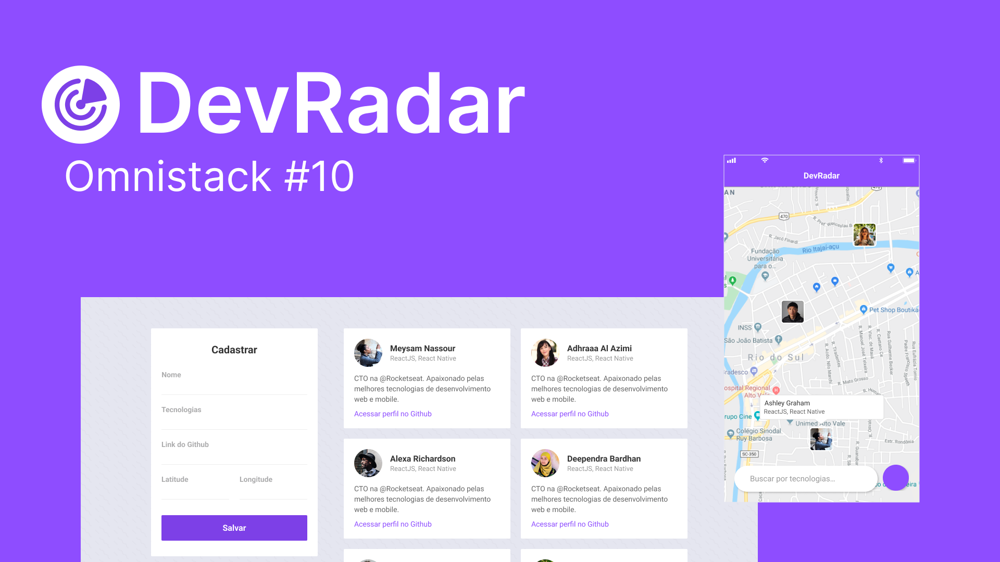

<h1 align="center">
    
</h1>

 

Projeto resultado da <a href="https://github.com/Rocketseat/semana-omnistack-10">Semana OmniStack 10</a> da <a href="https://rocketseat.com.br/">Rocketseat</a>. Ele consiste em criar uma aplicação simples de localização de desenvolvedores que usam as mesmas tecnologias.

  <a href="https://www.youtube.com/watch?v=NzVEqB7CSUE">
  
  Veja esse video demonstração!
  </a>

<h2>👨‍💻 Tecnologias Utilizadas</h2>
<ul>
<li><b>NodeJS:</b> Plataforma JavaScript assíncrona para construção de aplicações escaláveis e rápidas.</li>
<li><b>ReactJS:</b> Biblioteca JavaScript para criação de interfaces de usuário.</li>
<li><b>React Native:</b> Biblioteca que provê uma maneira eficiente de criar aplicações nativas para Android e iOS.</li>
<li><b>Expo:</b> Plataforma que permite desenvolver aplicações mobile com React Native que facilita o processo de build.</li>
<li><b>MongoDB:</b> Banco de dados orientado a documentos.</li>
<li><b>Socket.IO:</b> Biblioteca JavaScript para aplicativos da web em tempo real.</li>
</ul>

<h2>⚙️ Funcionalidades</h2>
<ul>
<li>Autenticação de usuário com OAuth e Github</li>
<li>Cadastro de desenvolvedores, e suas tecnologias</li>
<li>Localização dos desenvolvedores cadastrados em um mapa em tempo real</li>
<li>Visualização do perfil do Github do desenvolvedor</li>
</ul>

<h2>📁 Estrutura de Pastas</h2>
<ul>
<li><b>backend</b> - Parte do servidor do projeto, responsável por se comunicar com o banco de dados(MongoDB Atlas)</li>
<li><b>web</b> - Parte cliente do projeto, responsável pelo cadastro de programadores</li>
<li><b>mobile</b> - Parte cliente onde o app que roda no Android e IOS exibem o mapa com a localização, e o perfil do github dos desenvolvedores próximos.</li>
</ul>

<h2>🌐 Acesse o site</h2>

Para acessar o site, <a href="https://devradar.gui.dev.br">clique aqui</a>.

<h2>📱 Como usar a aplicação de celular</h2>

Instruções para executar um aplicativo Expo a partir do repositório:

<ol>
<li>
<strong>Instalação:</strong>

<ul>
<li>Certifique-se de ter o Node.js e o npm instalados no seu sistema.</li>
<li>Instale o Expo CLI globalmente usando o comando: <code>npm install -g expo-cli</code>.</li>
</ul>
</li>
<li>
<strong>Clone o Repositório:</strong>

<ul>
<li>Clone o repositório do aplicativo para o seu computador.</li>
</ul>
</li>
<li>
<strong>Navegue até o Diretório:</strong>

<ul>
<li>Abra o terminal e navegue até o diretório do projeto clonado.</li>
</ul>
</li>
<li>
<strong>Instalação de Dependências:</strong>

<ul>
<li>Execute o comando <code>npm install</code> para instalar as dependências do projeto.</li>
</ul>
</li>
<li>
<strong>Execução:</strong>

<ul>
<li>Utilize o comando <code>expo start</code> ou <code>npm start</code> para iniciar o servidor de desenvolvimento.</li>
<li>O Metro Bundler será aberto no seu navegador.</li>
</ul>
</li>
<li>
<strong>Teste no Dispositivo:</strong>

<ul>
<li>Baixe o aplicativo &quot;Expo Go&quot; da App Store ou Google Play.</li>
<li>Abra o aplicativo e escaneie o QR code exibido no Metro Bundler.</li>
</ul>
</li>
</ul>
</li>
</ol>

<h2>🫶 Agradecimentos</h2>
<ul>
<li>Agradeço ao <a href="https://github.com/filipedeschamps">Filipe Deschamps</a> por não só me incentivar, mas a outros a entrar nessa jornada de conhecimento maravilhosa.</li>
<li>Agradeço Rocketseat especialmente seu CTO <a href="https://github.com/diego3g">Diego Fernandes</a> por proporcionar essa espetacular experiência. E também a todos que trabalham nessa empresa incrível e estiveram presentes no suporte do Discord durante a semana.</li>
</ul>

<h2>🔗 Links</h2>
<ul>
<li><a href="https://www.figma.com/file/K4nGt9ORIPStY26d8YL252/DevRadar?type=design&node-id=0%3A1&mode=design&t=RHZCFSPEFHLPjC2n-1">Prototipagem do Projeto no Figma</a></li>
</ul>

<h2>📃 Licença</h2>

Este projeto está sobre a licença MIT. Veja ela em: <a href="LICENSE">LICENSE</a>.

Feito com 💜 por <a href="https://gui.dev.br">gsbenevides2</a>

